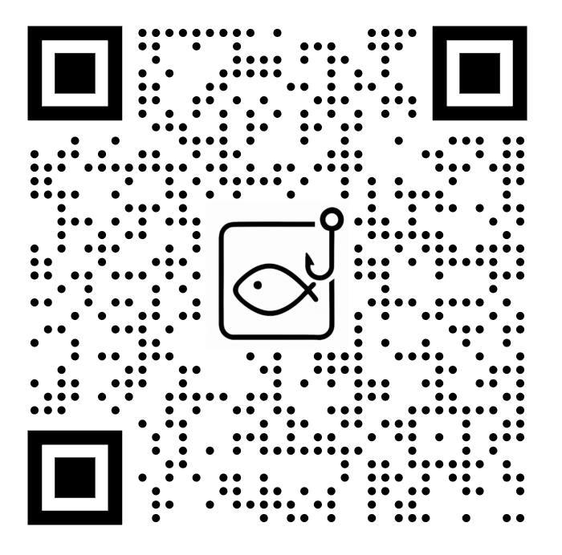

<div align="center">
    </img>
    <h1>DeviceCodePhishing</h1>
    <p><i>Based on <a href="https://github.com/nromsdahl/squarephish2">SquarePhish 2.0</a> by nromsdahl</i></p>
</div>

A customized fork of [SquarePhish 2.0](https://github.com/nromsdahl/squarephish2) — an advanced phishing tool that uses a technique combining the OAuth Device Code authentication flow and QR codes. This fork adds Vietnamese-language templates, a Google Form pretext mode, cleaner URL generation, and easier local/VPS deployment.

> See [PhishInSuits](https://github.com/secureworks/PhishInSuits) for more details on using OAuth Device Code flow for phishing attacks.

---

<div align="center">
    <h2>Attack Flow</h2>
</div>

### Step 1: Send Phishing Email

The operator sends an initial phishing email to the victim via the **Send Email** tab on the dashboard. By default, the `Google Form` pretext is used — a Vietnamese-language survey email containing a link that the victim is asked to click (or scan a QR code embedded in the page they land on).

> The current client id is: Microsoft Authentication Broker  
> The current scope is: `.default offline_access profile openid`

```
2025-04-20 02:29:30 INFO Email sent to victim(s): victim@example.com
```

### Step 2: Victim Clicks Link / Scans QR Code

The victim clicks the link (or scans the QR code) in the email. The link points to the SquarePhish phish server with a URL parameter containing the victim's email address:

```
https://your-domain.com/CkyAAx7xES?email=victim@example.com
```

> **Note:** When the phish server is running on port 443, the port is automatically omitted from the URL for a cleaner, more realistic look (e.g., `https://domain.com/...` instead of `https://domain.com:443/...`).

### Step 3: Device Code Flow Initiated

When the SquarePhish server receives the request, it:
1. Calls the Microsoft Device Code API to get a user code
2. Sends a second email (`devicecode_email.html`) to the victim containing the device code and instructions to enter it at `https://login.microsoftonline.com/common/oauth2/deviceauth`
3. Starts a background polling thread waiting for the victim to authenticate (polls for up to 15 minutes)

```
2025-04-20 02:29:34 INFO [victim@example.com] Link triggered
2025-04-20 02:29:34 INFO [victim@example.com] Initializing device code flow...
2025-04-20 02:29:34 INFO [victim@example.com]     Client ID: 29d9ed98-a469-4536-ade2-f981bc1d605e
2025-04-20 02:29:34 INFO [victim@example.com]     Scope:     .default offline_access profile openid
```

### Step 4: Victim Enters Device Code

The victim receives the device code email, visits the Microsoft device auth page, and enters the code. Once authenticated, the background thread retrieves and saves the access/refresh tokens to the database.

```
2025-04-20 02:29:40 INFO [victim@example.com] Polling for user authentication...
2025-04-20 02:29:40 INFO [victim@example.com] Authentication successful
2025-04-20 02:29:40 INFO [victim@example.com] Token retrieved and saved to database
```

---

<div align="center">
    <h2>Installation</h2>
</div>

**Requirements:** Python 3.9+, [`uv`](https://github.com/astral-sh/uv) (recommended) or `pip`

```bash
# Clone the repo
git clone https://github.com/luckystars0612/DeviceCodePhishing
cd DeviceCodePhishing

# Install dependencies with uv (recommended)
uv sync

# Or install with pip
pip install -e .
```

---

<div align="center">
    <h2>Configuration</h2>
</div>

Two config files are provided:

| File | Purpose |
|---|---|
| `config.json` | Production / VPS — phish server on port 443 with TLS |
| `config_local.json` | Local testing — no TLS, phish server on port 8081 |

### `config.json` (VPS / Production)

```json
{
    "dashboard_server": {
        "listen_url": "127.0.0.1:8080",
        "cert_path": "",
        "key_path": "",
        "use_tls": false
    },
    "phish_server": {
        "listen_url": "0.0.0.0:443",
        "cert_path": "server.crt",
        "key_path": "server.key",
        "use_tls": true
    }
}
```

### `config_local.json` (Local Testing)

```json
{
    "dashboard_server": {
        "listen_url": "127.0.0.1:8080",
        "cert_path": "",
        "key_path": "",
        "use_tls": false
    },
    "phish_server": {
        "listen_url": "0.0.0.0:8081",
        "cert_path": "",
        "key_path": "",
        "use_tls": false
    }
}
```

> **Note:** The dashboard always listens on localhost (`127.0.0.1:8080`) and does not require TLS. Only the phish server needs to be internet-accessible with a valid TLS certificate when deployed to a VPS.

---

<div align="center">
    <h2>Usage</h2>
</div>

> SquarePhish does not have authentication in front of the admin dashboard and as a result should be run behind a firewall or SSH tunnel and not directly exposed to the internet.

```
usage: squarephish [-h] [-c CONFIG] [-v] [--version]

options:
  -h, --help            show this help message and exit
  -c, --config CONFIG   Path to the config file (default: config.json)
  -v, --verbose         Enable verbose logging
  --version             show program's version number and exit
```

**Local testing (no TLS):**
```bash
uv run python -m squarephish -c config_local.json -v
```

**VPS / Production (with TLS on port 443):**
```bash
uv run python -m squarephish -c config.json -v
```

---

<div align="center">
    <h2>Dashboard</h2>
</div>

Access the dashboard at `http://127.0.0.1:8080` after starting the tool.

### Dashboard Overview

The dashboard view lets the operator view campaign metrics: number of emails sent, number of QR code scans, and a list of captured tokens. Each captured token can be viewed as a JSON object in a new tab.

### Configuration Tab

Configure the core settings before running a campaign:

- **SMTP settings** — host, port, username, password
- **SquarePhish server** — phish server host and port (used to generate URLs/QR codes)
- **Email settings** — sender address and subject line (used for both phishing and device code emails)
- **Entra settings** — client ID and OAuth scope for the Device Code flow
- **Device code email body** — the HTML template sent automatically when a victim triggers the phish link. Defaults to `pretexts/broker_auth/devicecode_email.html` if not customized

### Send Email Tab

Send the initial phishing email to one or more recipients. Available pretext modes:

| Mode | Template | Description |
|---|---|---|
| **Google Form** *(default)* | `google_form_email.html` | Vietnamese survey email with a link to the phish server |
| **QR Code** | `qrcode_email.html` | Email with an embedded QR code image |
| **ASCII QR Code** | `qrcode_ascii_email.html` | Email with a text-based QR code |
| **URL Link** | `url_email.html` | Plain email with a clickable link |
| **Device Code** | `devicecode_email.html` | Direct device code email (manual use) |

When `Google Form` mode is selected, you must also enter the **Google Form link** (`{GOOGLE_FORM_LINK}` placeholder) that will be embedded in the email body.

A **QR code preview** is available in the Send Email tab — enter a recipient email address and click the preview button to see the generated QR code before sending.

---

<div align="center">
    <h2>Custom Pretexts</h2>
</div>

Pretext templates are located in the [`pretexts/broker_auth/`](pretexts/broker_auth/) directory. When writing a custom template, use the following placeholders:

| Placeholder | Used in | Description |
|---|---|---|
| `{GOOGLE_FORM_LINK}` | `google_form_email.html` | Replaced with the Google Form / survey URL |
| `` | `qrcode_email.html` | Inline QR code image attachment |
| `{QR_CODE}` | `qrcode_ascii_email.html` | ASCII QR code text |
| `{URL}` | `url_email.html` | Direct phish server URL |
| `{DEVICE_CODE}` | `devicecode_email.html` | Microsoft device authentication user code |

---

<div align="center">
    <h2>Changes in This Fork</h2>
</div>

Compared to the upstream [nromsdahl/squarephish2](https://github.com/nromsdahl/squarephish2):

- **Vietnamese phishing templates** — `google_form_email.html` and `devicecode_email.html` updated with Vietnamese bilingual content for localized campaigns
- **`googleForm` pretext mode** — New send mode that embeds a custom Google Form / survey link. This is now the **default** selected mode in the Send Email tab
- **Clean URLs on port 443** — When the phish server runs on port 443, the port is automatically omitted from generated URLs (e.g., `https://domain.com/...` instead of `https://domain.com:443/...`)
- **UTF-8 encoding fix** — All template files are opened with `encoding="utf-8"` to correctly handle non-ASCII characters (Vietnamese, etc.)
- **QR code preview in dashboard** — Operators can preview and download the QR code for a recipient before sending the email
- **`config_local.json`** — Added for easy local development/testing without requiring TLS certificates
- **TLS handled via config** — `use_tls: true/false` in `config.json` controls whether TLS is enabled; no need to pass extra CLI arguments

---

<div align="center">
    <h2>Primary Refresh Token</h2>
</div>

When using the `Microsoft Authentication Broker` client ID, an attacker can take the returned refresh token and convert it into a Primary Refresh Token (PRT) using the included [gimmePRT](scripts/gimmePRT/) Python tool.

---

<div align="center">
    <h2>SquarePhish 1.0</h2>
</div>

The original version of SquarePhish, written in Python, is [hosted here](https://github.com/secureworks/SquarePhish).
